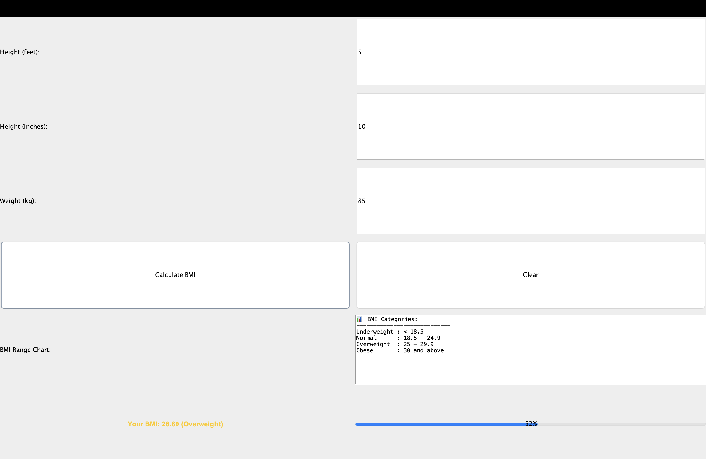

# BMI Calculator

A Java-based BMI (Body Mass Index) Calculator application with a graphical user interface. The app starts with a login screen and then provides BMI calculation functionality based on user input.

## Features
- **Login Screen:** Secure entry point to access the calculator.
- **BMI Calculation:** Compute BMI using weight and height.
- **Health Category:** Displays BMI category such as Underweight, Normal, Overweight, or Obese.
- **User-Friendly Interface:** Simple and clean design using Java Swing (or similar library).

## Tech Stack
- **Language:** Java
- **UI Framework:** Swing

## How to Run
1. Clone this repository:
   ```bash
   git clone https://github.com/AryanRastogii/BMI-Calculator.git
   ```
2. Navigate to the project directory:
   ```bash
   cd BMI-Calculator
   ```
3. Compile the code:
   ```bash
   javac Main.java
   ```
4. Run the application:
   ```bash
   java Main
   ```

## Project Structure
```
BMI-Calculator/
│
├── Main.java         # Entry point of the application
├── LoginFrame.java   # Handles the login UI
├── BMICalculator.java# BMI calculation logic
└── README.md         # Project documentation
```

## BMI Categories
| BMI Range       | Category        |
|-----------------|-----------------|
| < 18.5          | Underweight     |
| 18.5 – 24.9     | Normal Weight   |
| 25 – 29.9       | Overweight      |
| ≥ 30            | Obese           |

## Screenshots
